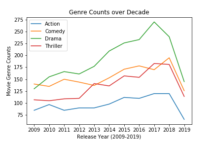
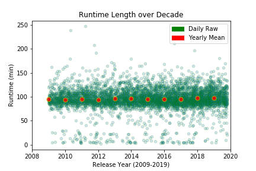

# Group-Project01-jun
Group Project01

## Group Members: Mohan, Vicky, Jack, Jun
* Due on Tuesday: October 22, 2019

## Project Idea
Research ideal movie to invest in for successful production based on collected data. 

* Analysis Notion: Decades worth data will guide us to visualize most popular and possibly successful trends as of today as market always tend to shift by the idea:survival of the fit.

### Release Date vs Movie Genre
* Filtered by top 4 of mostly produced genres that shows trends over the decade.
* As cliche as it sounds, Action movie is the way to go.
* One thing to note: 2019's data is incomplete yet and many data were dropped due to missing values, so sudden drops in 2019 isn't necessarily true.

### Release Date vs Movie Runtime
* Green scatters are individual year-month-day data since 2009 to today.
* Red scatter points are mean value per year.
* Deep dark green areas coincide well with red areas showing that over the decade runtime has always been steady in its place around 100 minutes.

    
